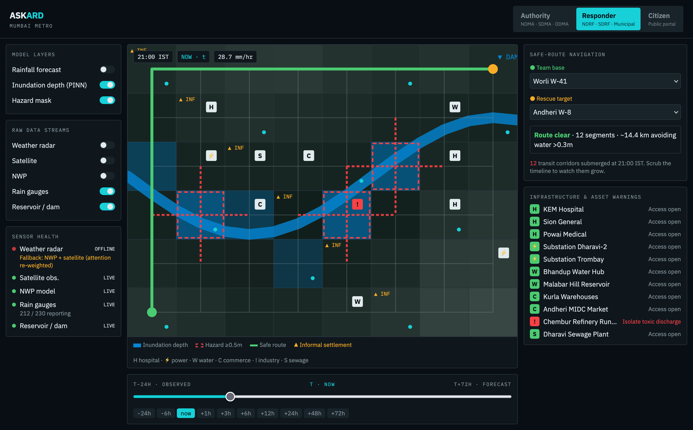
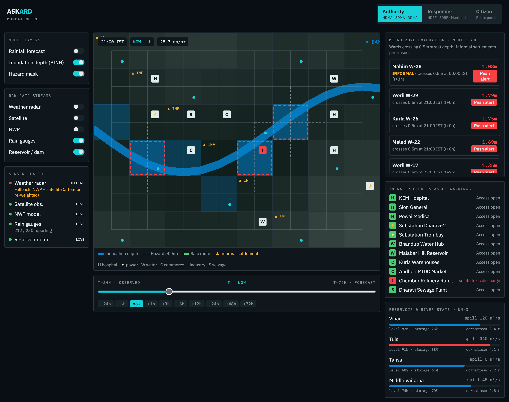

# ASKARD 

The **ASKARD** web platform serves as a real-time, interactive command portal that bridges complex physics-informed AI predictions with on-the-ground disaster response. ASKARD converts multi-modal rainfall forecasts, atmospheric observations, and street-level flood inundation models into clear geospatial intelligence—enabling synchronized, proactive decision-making across disaster management authorities, emergency responders, and local communities.

---

### 1. Interactive Geospatial Dashboard 

* **Dynamic Data Layers:** Toggleable map overlays for rainfall forecasts, physics-informed flood inundation depth rasters, and categorical hazard risk masks.
* **Multi-Source Data Overlays:** Real-time visibility into the five core raw data streams powering the pipeline—weather radar, satellite observations, Numerical Weather Prediction (NWP), ground rain gauges, and reservoir/dam telemetry.
* **Temporal Timeline Slider:** Continuous temporal controls allowing users to scrub smoothly from historical observation windows ($t-n$) through the present moment ($t$), up to the 0–72 hour forecast horizon ($t+k$).

---

### 2. Role-Based Access & Customized Views

The UI dynamically adapts its layout, metrics, and navigation tools depending on the authenticated user role:

| Stakeholder / Role | Focus | Core Capabilities |
| :--- | :--- | :--- |
| **Disaster Management Authorities** *(NDMA, SDMA, DDMA)* | Strategic Planning & Intervention | 1–6 hour operational lead-time windows, street-level depth forecasts, administrative ward metrics, and resource allocation panels. |
| **Emergency First Responders** *(NDRF, SDRF, Municipal)* | Tactical Rescue & Navigation | Dynamic safe-route navigation that automatically redirects response teams around submerged transit corridors in real time. |
| **Citizens & Vulnerable Communities** | Public Safety & Actionable Alerts | Simplified impact descriptions (e.g., *"0.8m street pooling expected at 15:30 IST"*), local ward safety statuses, and nearby shelter routing. |

#### Dashboard Interfaces

   
  <b>Figure 1:</b> Strategic Command Dashboard for Disaster Management Authorities (NDMA/SDMA/DDMA)

 

   
  <b>Figure 2:</b> First Responder Tactical Navigation & Dynamic Safe-Route Interface

 

   
  <b>Figure 3:</b> Public Citizen Safety Portal & Local Community Impact View

---

### 3. Impact & Micro-Zone Alerting System

* **Targeted Evacuation Zones:** Visual boundary highlights and automated push-alert triggers for high-risk micro-zones (e.g., informal settlements, low-lying wards) before water depths cross hazardous operational thresholds.
* **Infrastructure Protection Markers:** Interactive map markers for critical assets (hospitals, power substations, drinking water hubs) with live access-route status monitoring.
* **Asset & Contamination Warnings:** Automated notifications for commercial districts to relocate stock, alongside isolation warnings for industrial runoff zones and sewage treatment facilities to prevent toxic flood contamination.

---

### 4. Hydrological & System Health Panel

* **Reservoir & River State Dashboard:** Real-time side panel displaying variables feeding into the hydrological model (NN-3), including live storage percentages relative to Full Reservoir Level (FRL), spillway release rates ($Q_{\text{dam}}$), and downstream river gauge levels.
* **Sensor Health & Fallback Status:** System telemetry indicators tracking incoming radar, satellite, and ground station feeds. The UI alerts operators whenever dynamic feature masking activates fallback modes during sensor outages.
